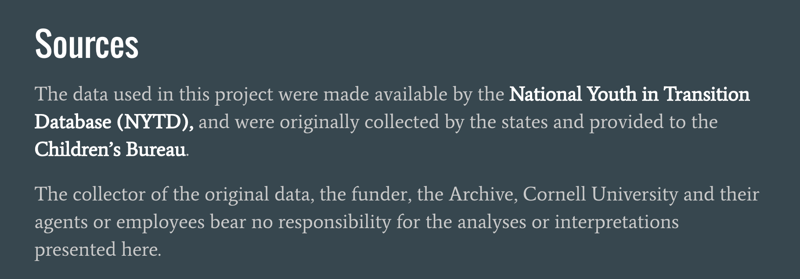

# Capstone Project Methodology
### Last Update: September 2016

## Project: Factors That Impact Educational Attainment Among Foster Youth

#### This repo folder contains the jupyter notebooks that document the steps and rationale for the project analysis. This repo does not contain project details such as problem statement, background information, project aims, etc. For these project details and an overview of my methodology, visit my capstone project blog post: https://kgracia44.github.io/capstone_post/

##### Raw Data Source:

**Note: The jupyter notebooks in this repo do not display resulting data that involve any kind of unique identification information. Instead, steps are described in notebook cells as markdown (as opposed to running cells and displaying results).

## ---- Approach --------------------------- 

1) Data Cleaning and Munging
    
    - Jupyter Notebook: CleanData_MungeData_3Sets
    
    - In this notebook:
        
        - Raw data reviewed, described, and cleaned. /n
        - Data wrangled into 3 data sets for analysis and saved in local postgres database and as CSV files.
        
        - 3 Data sets: Cohort1_Baseline_W1, Cohort1_W2, Cohort2_Baseline_W1
        
        * Please Note: In order to address data quality issue, 3 data sets used for analysis exclude data from the following   
        states: HI, IN, KY, MS, OR, TX, TN.

2) Exploratory Data Analysis (EDA)
    
    - Jupyter notebook: 
    
    - In this notebook:
        - Words